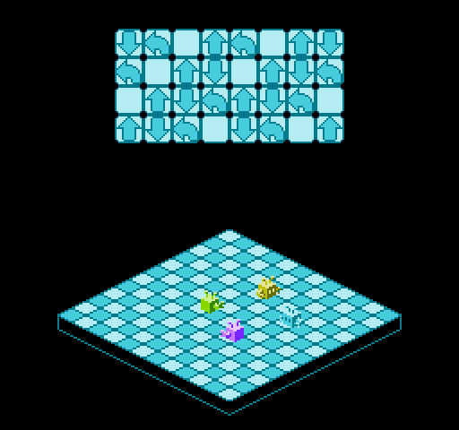

# co2: Lisp on NES/Famicom

A lisp for building NES/Famicom games.

More impressive screenshots to follow.

Generates 6502 assembly tested with  and .

Everything 8 bit currently, 16bit base addresses specified via
constantsor predefined registers. No garbage collection, variables and
direct memory peek/poke only. Supports rough function calling so
arguments work as expected until you call a function within a function,
whereapon they become clobbered. [this will now be fixed!] The plan is
to eventually provide a bunch of NES specific calls for sprites,
backgrounds and sound. All that is experimental for now.

Small example code, for reading the joypad button state:

    (defun (read-joypad)
      ;; need to 'strobe' register before reading
      (set! reg-joypad-0 1)
      (set! reg-joypad-0 0)
      ;; need to read multiple times until we get to the button we want
      ;; functions implicitly return the result of the last expression
      (loop n 0 8
         (poke! pad-data n (and (peek reg-joypad-0) #x1))))

    (defun (pressed key)
      (loop n 0 key
         (peek pad-data n)))

    (defun (update-sprite)
      ;; start sprite data dma to the oam
      (set! reg-oam-dma sprite-dma)

      (read-joypad)

      ;; control a range of sprites with the joypad
      (cond
       ((pressed joypad-up) (sub-sprites-y! 0 4 1))
       ((pressed joypad-down) (add-sprites-y! 0 4 1))
       ((pressed joypad-left) (sub-sprites-x! 0 4 1))
       ((pressed joypad-right) (add-sprites-x! 0 4 1))
       (else 0))
            
See example.co2 for more of this.

## Memory use

    $00 - $ef : defvar reserves it's addresses here
    $f0 - $fe : function arguments stored here
    $ff       : a compiler specific working register
    $200 - $2ff : sprite control data
    $300 - $31f : processed joypad data
    $320 - ...  : yours

## Fundamental stuff

General purpose 6502 code (so might work on c64 etc?). All numbers
follow racket conventions in terms of representation: `38` is decimal,
`#xff` is hex, `#b11011011` is binary.

### (defvar name value)

define and initialise a variable:

    (defvar num-poodles 45)

### (defun (name args ...) code)

defines a function:

    (deffun (square x) (* x x))

### (defint (name) code)

defines a function used as an interrupt handler (ends with "rts" opcode)

    (defint (vblank) 
        (do-game-things))

### (defconst name value)

defines a constant, compiler only - so no associated memory overhead

     (defconst sprite-data "$200") ;; where the sprite control data is

### (if expr true-expr false-expr)

if this then that else the other

    (if (pressed joypad-up)
        (set! up 1)
        (set! up 0))
        
as a proper scheme it returns it's expression result, so you can also do this:

    (set! up (if (pressed joypad-up) 1 0))

### (when expr true-expr-list)

if this then that

    (when (pressed joypad-up)
        (go-up))

### (cond ((expr then-expr-list) ... (else else-expr-list)))

helper to concatenate ifs (implemented as a macro)

    (cond
      ((pressed joypad-up) (go-up)
      ((pressed joypad-down) (go-down))
      ((pressed joypad-left) (go-left))
      ((pressed joypad-right) (go-right))
      (else 0))

also returns the expression result so:

    (set! direction
        (cond
          ((pressed joypad-up) 1)
          ((pressed joypad-down) 2)
          ((pressed joypad-left) 3)
          ((pressed joypad-right) 4)
          (else 0))

works...

### (eq? a b)

returns true (1) if two bytes are equal otherwise returns false (0):

    (when (eq? (sprite-x player-sprite) 100) 
        (do-something))

### (< a b)

returns true (1) if a byte is less than another otherwise returns false
(0):

    (when (< (sprite-x player-sprite) 100) 
        (do-something))

### (> a b)

returns true (1) if a byte is greater than another otherwise returns
false (0):

    (when (> (sprite-x player-sprite) 100) 
        (do-something))

### (not a)

returns true if given false or vice versa

    (when (not (> (sprite-x player-sprite) 100))
        (do-something))

### (loop index-variable start end expr-list)

a fairly optimal loop construct for ranges (much faster than while)

    (defvar n 0)
    (loop n 0 10
        (set-sprite-x! n 100))

### (while expr expr-list)

general purpose looping

    (defvar n 0)
    (while (< n 10)
        (set-sprite-x! n (* n 10))
        (inc n))

### (do expr-list)

collect a bunch of expression together, returns result of the last one 

    (do 
      (something)
      (something-else))

### (asm assembly-string)

insert raw assembly code 

    (asm
      ".byte \"NES\",$1a" ;; number of prg-rom blocks
      ".byte $01" ;; number of chr-rom blocks
      ".byte $01" ;; rom control bytes: horizontal mirroring, no sram or trainer, mapper #0
      ".byte $00,$00" ;; filler
      ".byte $00,$00,$00,$00,$00,$00,$00,$00")

### (set! variable value)

assignments

    (defvar num-poodles 0)
    (set! num-poodles 100)

### (poke! base-addr [offset] value)

write to memory. base address can be a const or register 16bit address,
offset and value are normal 8 bit expressions. offset is optional,
reduces instruction count if you don't need it.

     ;; store button status
     (loop n 0 8
         (poke! pad-data n (and (peek reg-joypad-0) #x1))

### (peek base-addr [offset])

returns the contents of memory at the specified address. offset is optional, reduces instruction count if you don't need it.

     ;; store button status
     (loop n 0 8
         (poke! pad-data n (and (peek reg-joypad-0) #x1))

### (+ a b)

8 bit addition with carry

    (+ (- 1 2) (* 2 3) 8)

### (- a b)

8 bit subtraction

    (+ (- 1 2) (* 2 3) 8)

### (* a b)

8 bit multiplication

    (+ (- 1 2) (* 2 3) 8)

### (and a b)

8 bit and - can be used for masking or logical operations.

    (when (and (peek reg-joypad-0) #x1)
        (do-something))

### (or a b)

8 bit or - can be used for masking or logical operations.

    (when (or (pressed joypad-a) (pressed joypad-b))
        (do-something))

### (xor a b)

8 bit xor (eor in asm) - can be used for bit flipping, eg:

    (define (toggle-bit-zero a)
        (xor a #b00000001))

### (inc a)

increment a variable by one - maps to a single instruction

    (defvar n 0)
    (while (< n 10)
        (set-sprite-x! n (* n 10))
        (inc n))
    

## (dec a)

decrement a variable by one - maps to a single instruction

    (defvar n 20)
    (while (> n 10)
        (set-sprite-x! n (* n 10))
        (dec n))

## (<< a num-bits)

8 bit left shift

    (defvar num-poodles 10)
    (set! num-poodles (<< num-poodles 2)) ;; 40 = 10*4

## (>> a num-bits)

8 bit right shift

    (defvar num-poodles 10)
    (set! num-poodles (>> num-poodles 1)) ;; 5 = 10/2

# Experimental

NES/Famicom specific commands. These are subject to much change, while
we figure out how the architecture works and the best approach to game
programming.

## (wait-vblank)

delay for a vblank

    (wait-vblank)

## (org addr)

set location of following code/data

    (org #xc000)

## (memset address value)

block writes an entire page - 256 bytes to a 16bit address

    ;; clear sprite data
    (memset sprite-data 0)

## (ppu-memset addr length value)

block writes value into ppu memory from address 

    ;; write a load of tile ids to background memory
    (ppu-memset ppu-name-table-1 #xff tile-id)

## (ppu-memset-carry-on length value)

contiues block writing from where the previous ppu-memset/carry-on left
off. allows you to write more than 256 bytes.

    (ppu-memset ppu-name-table-1 #xff tile-id)
    (ppu-memset-carry-on #xff (+ tile-id 1))

## (ppu-memcpy dstaddr length sourceaddr)

copy a load of cpu bytes to the ppu. dst and src addresses need to be 16bit constants/registers.

    ;; load a palette
    (asm "palette: .incbin \"example.pal\"")
    ...
    ;; copy all 32bytes of bg/sprite palette into the ppu
    (ppu-memcpy ppu-palette #x20 palette))

## OAM commands

sprites: still working on the best way to do these...

- set-sprite-x!
- set-sprite-y!
- set-sprite-id!
- set-sprite-attr!
- get-sprite-x
- get-sprite-y
- get-sprite-id
- get-sprite-attr
- add-sprite-x!
- add-sprite-y!
- sub-sprite-x!
- sub-sprite-y!
- or-sprite-attr!

# registers

these are defined as constants for your convenience and enjoyment.

## ppu/oam registers

- reg-ppu-ctl              
- reg-ppu-mask             
- reg-ppu-status           
- reg-oam-addr             
- reg-oam-data             
- reg-ppu-scroll           
- reg-ppu-addr             
- reg-ppu-data             
- reg-oam-dma 

### apu registers

- reg-apu-pulse1-control   
- reg-apu-pulse1-ramp      
- reg-apu-pulse1-ft        
- reg-apu-pulse1-ct        
- reg-apu-pulse2-control   
- reg-apu-pulse2-ramp      
- reg-apu-pulse2-ft        
- reg-apu-pulse2-ct        
- reg-apu-tri-control      
- reg-apu-tri-ft           
- reg-apu-tri-ct           
- reg-apu-noise-env        
- reg-apu-noise-ft         
- reg-apu-noise-ct         
- reg-apu-dmc-control      
- reg-apu-dmc-dac          
- reg-apu-dmc-addr         
- reg-apu-dmc-size         
- reg-apu-channel          

### input

- reg-joypad-0             
- reg-joypad-1 

- joypad-a 
- joypad-b 
- joypad-select 
- joypad-start 
- joypad-up 
- joypad-down 
- joypad-left
- joypad-right
            
### ppu vram addresses

- ppu-name-table-0  
- ppu-attr-table-0  
- ppu-name-table-1  
- ppu-attr-table-1  
- ppu-name-table-2  
- ppu-attr-table-2  
- ppu-name-table-3  
- ppu-attr-table-3  
- ppu-palette       
- ppu-bg-palette    
- ppu-sprite-palette 

# program structure

follows normal NES/Famicom behaviour

    (do
      NES header stuff...
      (org #xc000) ;; code start
      (defun ...)
      (defun ...)
      ...
      (defint (vblank) ...)
      (defint (reset) ...)
      (defint (irq) ...)
      data
      ;; set up the interrupt vectors
      (asm ".word vblank, reset, irq")
      more data
      )
      
